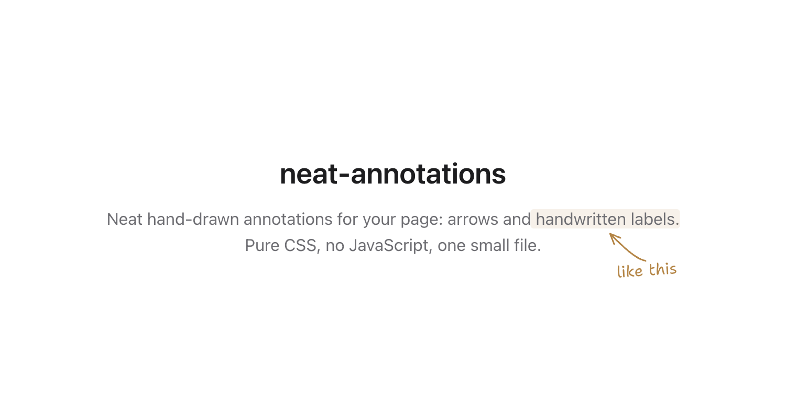
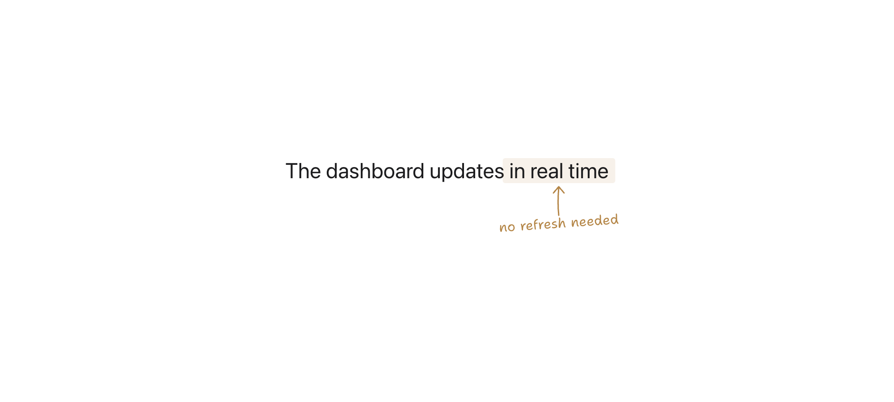
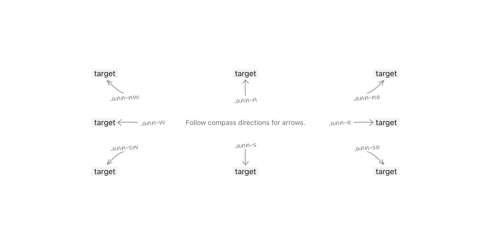
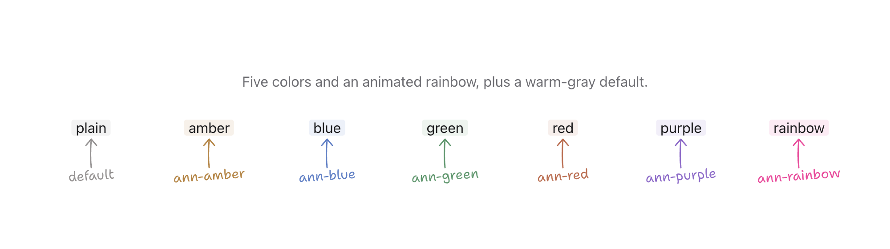

<p align="center">
  
</p>

# neat-annotations

Hand-drawn arrows and handwritten labels for your website. Pure CSS, no JavaScript, no build step — one self-contained file.

[Demo](https://neat-annotations.syabro.com/) · [CSS file](neat-annotations.css) · [GitHub](https://github.com/syabro/neat-annotations)

## Quick start

Add the stylesheet from jsDelivr, or download [`neat-annotations.css`](neat-annotations.css) and serve it locally:

```html
<link rel="stylesheet" href="https://cdn.jsdelivr.net/gh/syabro/neat-annotations/neat-annotations.css">
```

Wrap the element you want to annotate:

```html
The dashboard updates <span class="ann ann-n ann-amber" data-note="no refresh needed">in real time</span>
```

Shantell Sans is optional. Load it to match the demo; otherwise labels fall back to a cursive font:

```html
<link href="https://fonts.googleapis.com/css2?family=Shantell+Sans:wght@400;500;600&display=swap" rel="stylesheet">
```

**Layout note:** annotations are positioned outside their target and do not reserve space. Leave enough margin around annotated lines for the arrow and label.

<p align="center">
  
</p>

## API

Start with `ann`, then add a direction and color when needed. The label comes from `data-note`.

### Directions

A direction class names where the arrow points. For example, `ann-n` places the label below the target and points the arrow north toward it.

<p align="center">
  
</p>

`ann-n` · `ann-ne` · `ann-e` · `ann-se` · `ann-s` · `ann-sw` · `ann-w` · `ann-nw`

```html
<span class="ann ann-n" data-note="points north">target</span>
```

### Colors

The default is warm gray. Six built-in classes change the arrow, label, and target highlight together:

<p align="center">
  
</p>

`ann-amber` · `ann-blue` · `ann-green` · `ann-red` · `ann-purple` · `ann-rainbow`

`ann-rainbow` animates through hues and respects `prefers-reduced-motion`.

### Custom colors

Set any CSS color directly with `--ann-color`:

```html
<span class="ann ann-n" data-note="..." style="--ann-color: #ff1493">hot pink</span>
```

### Highlight only

Omit `data-note` and the direction class to use an annotation as a text marker without an arrow or label:

```html
<span class="ann ann-amber">important</span>
```

### Target highlight

Add `ann-no-mark` when the target already has its own fill:

```html
<span class="ann ann-n ann-purple ann-no-mark" data-note="keeps its own fill"><span class="badge">stable</span></span>
```

Annotations can be nested to point at one target from different sides. Long notes wrap according to `--ann-label-max-width`. See the [demo](https://neat-annotations.syabro.com/) for both patterns.

## Fine-tuning

Set these variables directly on an annotated element:

| Variable | Default | What it controls |
| --- | --- | --- |
| `--ann-color` | warm gray | arrow and label color |
| `--ann-mark` | theme-aware tint | target highlight; `ann-no-mark` removes it |
| `--ann-font` | `'Shantell Sans', cursive` | label font |
| `--ann-target-gap` | `5px` | gap between target and arrow |
| `--ann-label-gap` | `6px` | gap between arrow and label |
| `--ann-lower-label-gap` | `-4px` | adjustment for labels below the target |
| `--ann-label-max-width` | `150px` | maximum label width before wrapping |
| `--ann-arrow-x` / `--ann-arrow-y` | `0px` | arrow position |
| `--ann-text-x` / `--ann-text-y` | `0px` / `5px` | label position |
| `--ann-rotate` | `-4deg` | label tilt |

## Accessibility

Annotations are visual enhancements. Do not use `data-note` as the only source of instructions, status, validation, or other essential information. Repeat important content in visible HTML or connect a real description to the target with `aria-describedby`.

## License

[MIT](LICENSE)
